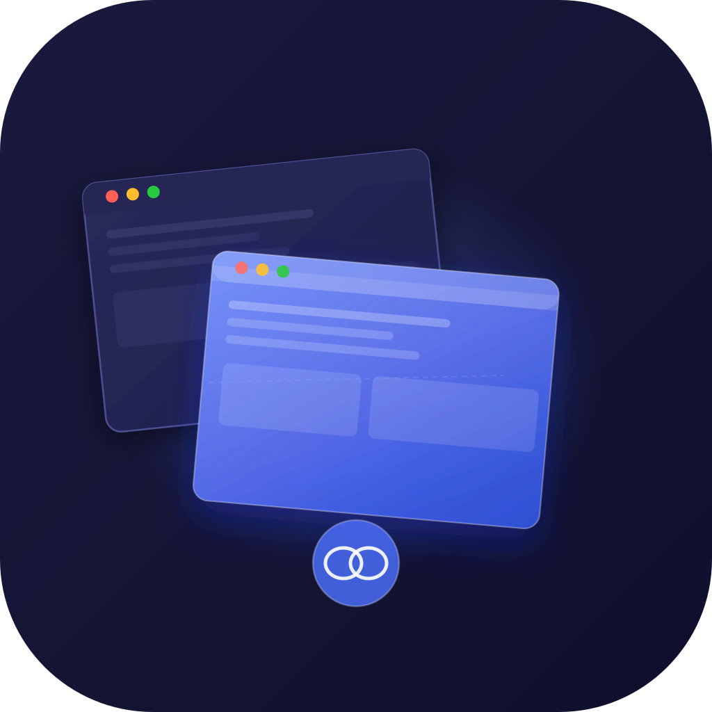
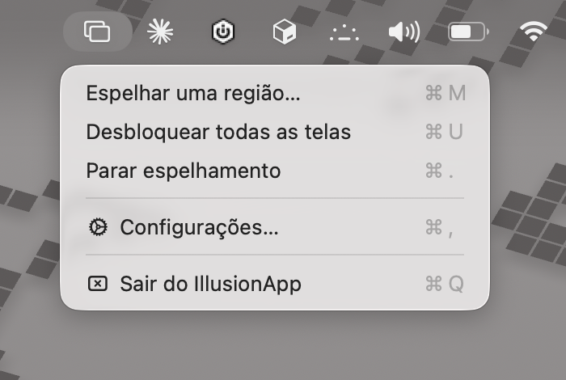
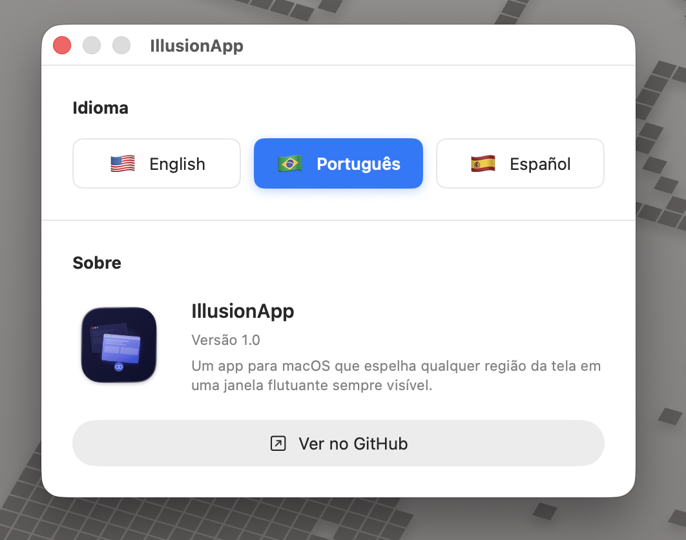
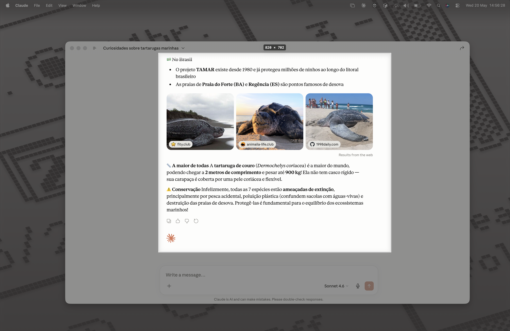
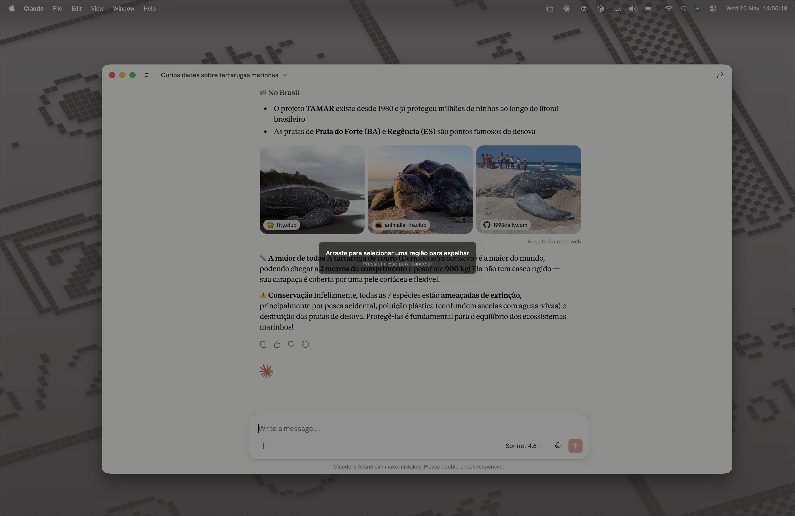
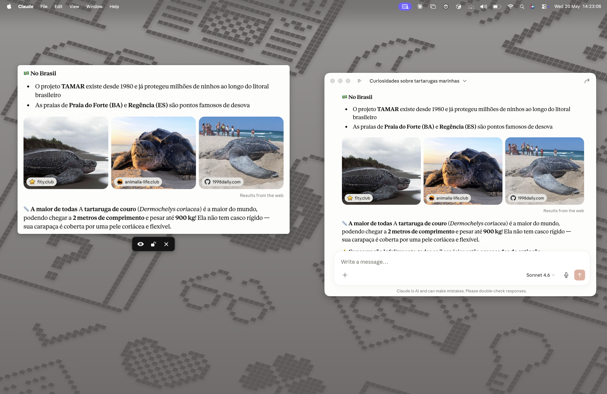
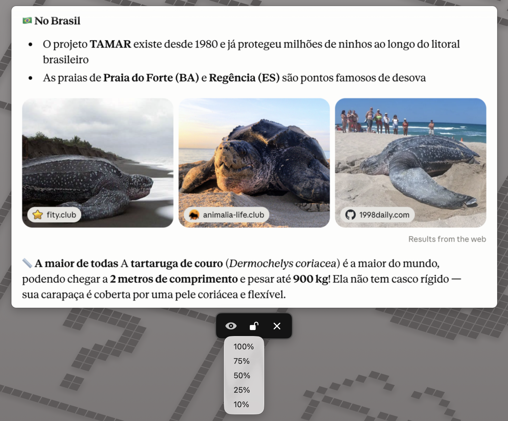

# IllusionApp

<p align="center">
  
</p>

<p align="center">
  
  
  
</p>

A macOS app that mirrors any region of your screen into a floating, always-on-top window.

## Screenshots

<p align="center">
  
  &nbsp;&nbsp;
  
</p>

<p align="center">
  
</p>

<p align="center">
  
</p>

<p align="center">
  
</p>

<p align="center">
  
</p>

## Features

- **Region selection** — drag to pick any area of the screen, ESC to cancel
- **Floating mirror window** — stays above all other apps, freely positionable and resizable
- **Floating controls panel** — appears below the mirror window on hover with opacity, lock, and close buttons
- **Multiple mirrors** — up to 6 simultaneous mirror windows
- **Opacity control** — 10% / 25% / 50% / 75% / 100%
- **Lock mode** — locks position/size and makes clicks pass through. Unlock all via menu bar (⌘U)
- **Localization** — English, Português (BR), Español — switchable in Settings
- **Settings window** — language selector and About section (version, GitHub link)
- **60 fps capture** — powered by ScreenCaptureKit's SCStream

## Requirements

- **macOS 26 Tahoe or later** (set via `MACOSX_DEPLOYMENT_TARGET = 26.0`)
- Screen Recording permission (the system will prompt on first launch)
- For building from source: Xcode 26+ with Swift 6 toolchain

## Install (pre-built release)

1. Download `IllusionApp-vX.Y.Z.zip` from the [Releases page](https://github.com/HyagoHenrique/IllusionApp/releases)
2. Unzip and move `IllusionApp.app` to `/Applications`
3. Authorize Gatekeeper (see below) — required because the release builds are unsigned
4. Grant **Screen Recording** permission when prompted (System Settings → Privacy & Security → Screen Recording)

### Gatekeeper / "app is damaged or can't be opened"

The release builds are **unsigned** (ad-hoc signature only) because notarization requires a paid Apple Developer account. macOS will block the app on first launch with one of these messages:

- *"IllusionApp" cannot be opened because the developer cannot be verified*
- *"IllusionApp" is damaged and can't be opened*

**To authorize the app:**

**Option A — Right-click → Open (easiest)**
1. In Finder, right-click (or Control-click) on `IllusionApp.app`
2. Choose **Open**
3. Click **Open** in the warning dialog
4. macOS remembers the choice; future launches work normally

**Option B — System Settings**
1. Try to open the app once (macOS will block it)
2. Open **System Settings → Privacy & Security**
3. Scroll down to the *Security* section — there will be a message about IllusionApp being blocked
4. Click **Open Anyway**
5. Confirm with your password

**Option C — Terminal (if you see "is damaged")**
The "damaged" message appears because of the quarantine attribute set when downloading from the browser. Remove it:
```bash
xattr -dr com.apple.quarantine /Applications/IllusionApp.app
```
Then open the app normally.

> **Why unsigned?** Notarizing requires Apple's Developer Program ($99/year). If you want a notarized build, clone the repo and build it yourself in Xcode with your own signing identity.

## Building

1. Open `IllusionApp.xcodeproj` in Xcode 26+
2. Select your development team in *Signing & Capabilities*
3. Build & Run (`⌘R`)

> **Note:** The app sandbox is **disabled** so ScreenCaptureKit can capture other apps' content. The project also requests `com.apple.security.screen-capture` and `com.apple.security.system-content` entitlements (the latter is required on macOS 26 Tahoe for SCK process enumeration). For Mac App Store distribution you would need to re-enable the sandbox.

## Usage

1. Click the **rectangle-on-rectangle** icon in the menu bar
2. Choose **Mirror a region…** (`⌘M`)
3. Drag to select the area you want to mirror (ESC cancels)
4. The mirror window appears — drag it anywhere, resize freely
5. Hover the mirror to reveal the **floating controls panel** below it:
   - **Eye** — opacity (10% / 25% / 50% / 75% / 100%)
   - **Open lock** — lock the window (clicks pass through, position frozen)
   - **✕** — close the mirror
6. To unlock all locked mirrors: menu bar → **Unlock all screens** (`⌘U`)
7. Change app language and view About info: menu bar → **Settings** (`⌘,`)

## Architecture

```
IllusionApp/
├── App/
│   ├── IllusionApp.swift               Entry point, connects AppDelegate
│   └── AppDelegate.swift               Status bar, orchestrates selection → mirror flow
├── Features/
│   ├── Selection/
│   │   ├── SelectionOverlayWindow      Fullscreen NSWindow for drag-select UI, ESC handling
│   │   └── SelectionView               SwiftUI drag gesture + visual feedback
│   ├── Mirror/
│   │   ├── MirrorWindow                NSWindow subclass (floating, transparent, resizable)
│   │   ├── MirrorView                  Renders captured frames + hover tracking
│   │   ├── MirrorViewModel             Capture lifecycle, hover state, CMSampleBuffer → CGImage
│   │   ├── MirrorControlsWindow        Separate floating NSPanel for the controls bar
│   │   └── MirrorControlsView          SwiftUI controls (opacity menu, lock, close)
│   ├── Capture/
│   │   └── ScreenCaptureManager        SCStream wrapper, publishes frames as AsyncStream
│   └── Settings/
│       ├── SettingsWindowController    NSWindowController for the Settings window
│       └── SettingsView                SwiftUI: language picker + About section
└── Shared/
    ├── Models/MirrorRegion             Value type: rect + displayID
    ├── Localization/
    │   ├── LocalizationManager         ObservableObject — current language, persistence
    │   └── AppStrings                  All localized strings (EN / PT-BR / ES)
    └── Extensions/CGRect+Extensions    Coordinate system conversions
```

## License

MIT — see [LICENSE](LICENSE).
